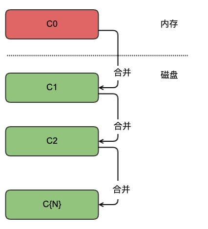
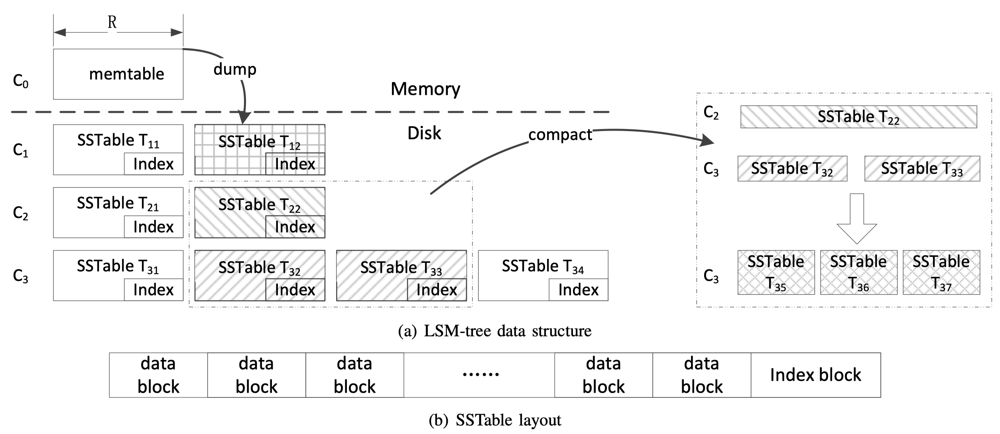

### 常用的数据检索结构

| 作者 | 时间 |QQ技术交流群 |
| ------ | ------ |------ |
| perrynzhou@gmail.com |2020/12/01 |672152841 |

####  哈希表

- 哈希表支持增、删、改、查操作，但是支持范围查找较差；因为哈希表特性，如果进行范围查找，一个范围的所有数据都必须经过哈希计算来查找对应的链表节点，这几乎是需要这个范围每一个数据都需要去哈希表中查找一次，性能比较差。

#### B+树

- B+树支持增、删、改、查操作，并且很好支持范围查找，插入和查找性能均衡。
- B+树的结构每个非叶子节点是数据索引，叶子节点是数据或者数据的指针。B+树叶子节点之间的连接可以实现高效的范围查询，例如innoDB存储引擎默认就是B+树结构.

- 传统的B+树读写相对比较均衡，但是当内存容量小于数据集时候，大量随机写使得的插入和更新操作变得很慢。采用随机写是因为在B+树中，写操作是原地更新数据。比如修改B+树中某个叶子节点的数据，基本分为两步，第一是查找叶子节点数据，第二是原地更新这个值。这样的操作基本对于磁盘都是随机写，不能充分利用好磁盘

#### LSM树

- LSM树支持增、删、改、查操作以及范围查找操作，插入操作非常快，但是查找性能一般

- LSM树通过避免随机写入问题，将随机写转换为顺序写，大大提高了写性能。LSM树和B+树比起来牺牲了部分读性能，来提高写性能。自身的读性能可以通过一定的方式来提供。

- LSM树基本设计思想是把多个磁盘随机写合并为顺序写，它会把LSM树中节点更改记录到新的磁盘上，而不是直接修改LSM树中节点的值。比如B+树需要修改10个离散的节点的值，B+树首先找到这10个值的所在磁盘位置，然后更改每个节点的值，这就产生了一个磁盘的随机写，这样反复10次，代价比较大。LSM树则是把10个离散的节点新值顺序写入到磁盘的新位置，所以进行了一次的顺序写，因此LSM树的写性能显著优于B+树。

- LSM树每次更新或者插入，数据都写入到磁盘的新位置，写操作完成，这样不仅造成磁盘的空间冗余，也会降低性能。在LSM树的相关论文中给的一种实现方式，它把一棵树分割为多层，每一层都是B+树，并且越下面的层包括的树越大。

  

- 如上图内存中C0保存了新写入的数据，余下的C1~C{N}都存储在磁盘上。C0的B+树是存储在内存里而不是磁盘中。所以直接操作C0的B+树代价都很小。为了防止C0操作中内存掉电会引起数据丢失的问题，当收到数据写请求，此次写请求会记录WAL日志，然后再次写入到C0中，及时内存掉电也可以从WAL中恢复C0的数据。

- 当C{N}中B+树越来越大后，会把C{N}的部分叶子节点合并到C{N+1}中，这个过程就是何必并。为什么需要合并呢？因为随着小的B+树越来越多，每次读操作需要查询更多的树，这会导致读性能越来越差，因此需要在适当时候对磁盘上的小树进行合并，将多个小的B+树合并为一个大的B+树，通过合并还可以删除旧版本的数据，释放空间。比如leveldb合并和这个类似，不同的每一层的在磁盘上的实现是有些不同的，leveldb的合并具体参见下图

  

