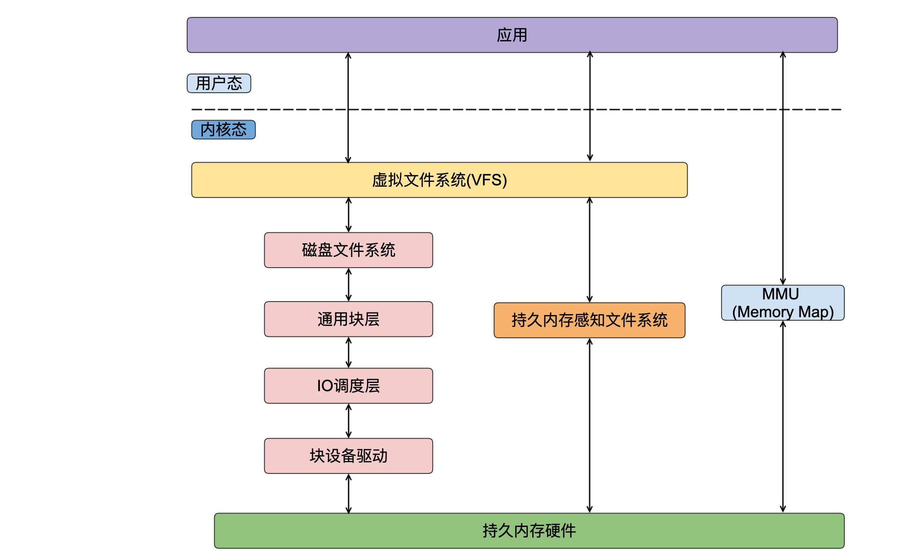
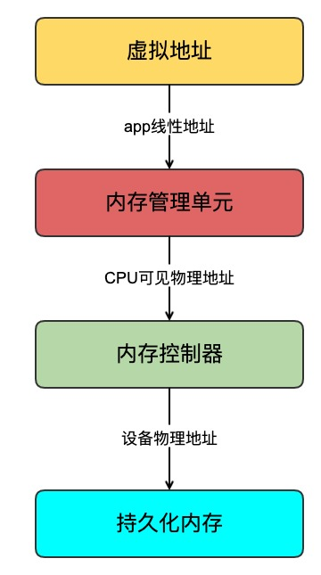

## 持久化内存数据访问

| 作者 | 时间 |QQ技术交流群 |
| ------ | ------ |------ |
| perrynzhou@gmail.com |2020/12/01 |672152841|

####  持久化内存访问链路

#### 访问链路说明

- 第一种，应用端发起read/write操作，会进入内核的vfs的相关函数，如果数据在page cache中，直接访问page cache.如果不在则从磁盘中美读取。通常内核会通过磁盘文件系统确定文件所在文件系统块的大小，根据你文件系统块大小计算出请求数据的长度，通过磁盘文件系统的函数来访问inode,然后根据inode来确定数据所在磁盘的位置。内核将所有请求转发到通用块设备，通过IO调度将IO进行重排和合并，最终通过块设备驱动层向持久化内存硬件发送IO指令进行实际的IO操作
- 第二种,通过持久内存感知文件系统，然后直接到持久化内存硬件完成一个请求
- 第三种，通过nmap/unmap方式将持久化内存映射出去，应用端直接拿着映射出来的地址进行读写数据。这种方式将一个线性区域可以和系统的一个普通文件或者块设备文件相关联，内核把对线性区内某个字节的访问转换为文件中对应字节的操作，这是内存映射的访问方式。在这种访问模式下应用直接访问持久化内存介质，没有内核参与中断和上下文切换，是的持久内存的性能达到最优。

#### 持久化内存硬件数据存储

##### 基本知识

- 块设备是虚拟文件系统和磁盘文件系统传送数据的基本单元，每一个块都存放在Page Cache中国，当内核读取物理块 时候，检查块是否存在于Page Cache中，如果不存在Page Cache，内核会产生一个缺页中断，然后分配一个新页，然后从磁盘物理块中读取数据回填到这个新Page中。如果是写操作，数据在写到物理块之前，内核依然需要检查对对应的块是否在PageCache中，如果不在，产生Page Fault中断，并分配一个新页，并且将数据填充到该页，在Page Cache中修改数据块不会马上写回到物理块，而是会延迟一段时间后再对磁盘设备进行更新。
- 传统的块设备访问是通过内存映射方式进行，写操作访问的不是物理磁盘，而是PageCache.及时一个字节修改，也有可能触发内核产生缺页中断，以分配新页，将一些物理块读取新页，然后在这个Page中进行一个字节的修改，并在合适的时机由内核或者应用将这个page数据更新到磁盘。

##### 持久化内存感知文件访问

- 持久化内存感知文件系统使用字节可寻址的方式访问系统的线性地址，经过缺页中断在内存管理单元中建立虚拟地址到持久内存块的链接，内存控制器通过这些物理块地址直接访问持久内存介质。

  

##### 块设备访问

- 传统的块访问是将磁盘文件系统IO请求通过块窗口设备驱动访问真正的持久化内存。基本分为如下基本:
  - 第一是确定内核要你读写的目标缓冲区
  - 第二确定IO请求的外部逻辑块地址(Logic Block Address,LBA)
  - 第三讲外部LBA传递给块翻译表(Block Translation Table,BTT),根据写入原子性的需求，BTT空闲块大小和数量计算出正确的映射后的LBA，将映射后的LBA转换为命名空间的偏移量
  - 第四，将命名空间的偏移量转为设备物理地址
  - 第五，选择可用的块窗口（Block Window,BW)命令寄存器、状态寄存器和BW孔径编程来 使用命名空间描述持久化内存设备
  - 释放BW资源并取消映射目标缓冲区